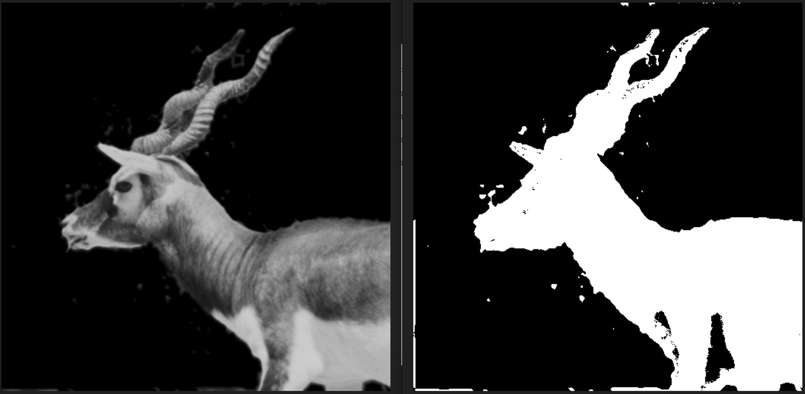
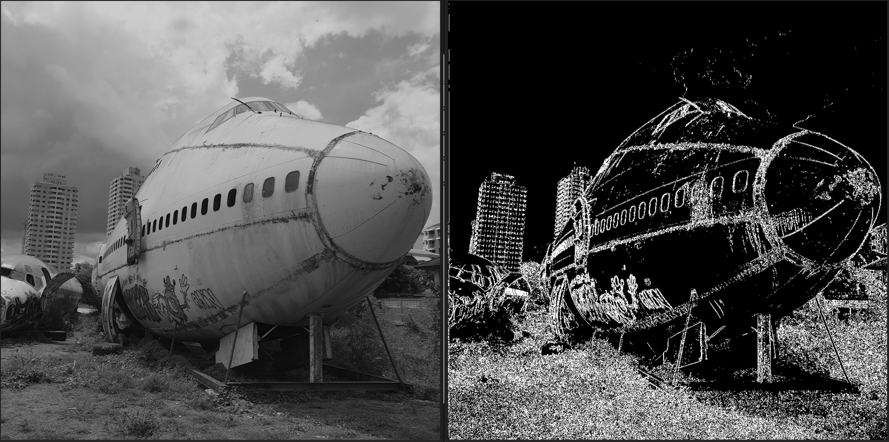

# Introduction

This project runs through an FPGA implementation of the [Roberts Cross](https://en.wikipedia.org/wiki/Roberts_cross "RC") (RC) operation for Edge Detection on an image. It is a discrete differential operator that approximates the gradient of an image. Two images, a [blackbuck](#blackbuck) and junkyard [boeing](#boeing) plane are used to show the simulation results of a synthesizable rtl RC module.  

The goal of this exercise is to visualize the RC Operator in action with a real image using simulation first. It is untested in hardware due to time limitations. <!--TODO : maybe try to test in hardware, time permitting--> Vivado 2023.2 is used for simulation. 

# Contents

    1. images folder
        a. blackbuck_grayscale
        b. boeing_grayscale
        c. out_blackbuck_T24
        d. out_boing_grayscale_T24
    2. rtl folder
        a. top_level.vhdl
        b. data_load_block.vhdl
        c. data_execution_block.vhdl
    3. sim folder
        a. tb.vhdl

# How to Run

A threshold value is arbitrarily selected and changed in the 8-bit variable, in *data_execution_block.vhdl* file as shown below in line 56. Please change that value to your choosing. In the future, this should be added as generic to this module for ease of user specification. 

Please create a Vivado project with these source files and the testbench. 

``` vhdl
signal T : std_logic_vector (7 downto 0):="00011000"; --Threshold made to 24
```

In testbench file *tb.vhdl* in sim folder, change the image file to the one you want to run the RC operation on, specifically inBmp and outBmp constants in lines 66 and 67 (in *tb.vhdl*), respectively. The TXX after 'out' in line 67 is short for Threshold of 24 and ensure that is changed to the corresponding value input above. 

``` vhdl
  constant inBmp	: string := "boeing_grayscale.bmp";
  constant outbmp 	: string := "outT24_" & inBmp;
```

Only BMP files are able to be processed by this module. Place the desired grayscale BMP files in the Vivado project path below

    ~\RobertsCross.sim\sim_1\behav\xsim 

if the Vivado project is named RobertsCross. The generated output will also be in the same folder for the final result. After the images are placed now the simulation needs to be run. Please allow some time for it to be complete after "Run All" is pressed. *tb.vhdl* needs to be in VHDL-2008 as it uses **finish** keyword. 

# Simulation Results

Both the images are of different sizes but the testbench module can handle different sizes dynamically. The original images have been grayscaled for a better RC result. Otherwise the clouds in the boeing result would signficantly interfere in the final image. 

## Blackbuck

<div align="center">
  <figure>
    
    <figcaption>Figure 1: Comparison of original grayscale blackbuck image to the RC processed with threshold of 14 </figcaption>
  </figure>
</div>

## Boeing

<div align="center">
  <figure>
    
    <figcaption>Figure 2: Comparison of original grayscale junked boeing plane image to the RC processed with threshold of 24 </figcaption>
  </figure>
</div>


